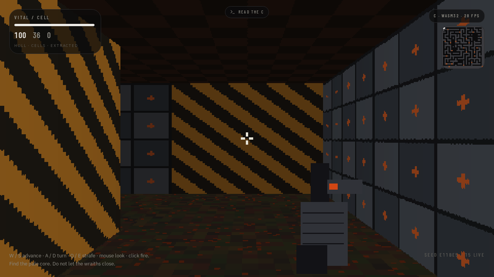

# EMBERCAST

**A real-time 3D software engine written in pure C.**




No GPU. No libraries. No textures on disk. One file of C paints a first-person
labyrinth into a 480×270 RGBA framebuffer using DDA raycasting, floor/ceiling
casts, billboards, hitscan, and a generated maze — then the same source
compiles to a **30 KB** freestanding `wasm32` kernel.

```
gcc -O3 -o embercast engine/embercast.c engine/native_main.c -lm
./embercast --selftest
./embercast
```

Native bench on a quiet core: **~220 fps** at 480×270, every pixel software.

---

## Why this exists

Most “3D in the browser” is a GPU talking to a scene graph. EMBERCAST is the
other stack: a CPU walking a grid, one column at a time, the way Wolfenstein 3D
did it in 1992 — except this time the host is either a terminal or WebAssembly
with **zero libc**.

```
  mouse / keys / analog
           │
           ▼
    ┌─────────────┐     DDA + floor      ┌──────────────┐
    │  embercast  │ ───────────────────► │ 480×270 RGBA │
    │   .c kernel │     sprites, gun     │  framebuffer │
    └─────────────┘                      └──────────────┘
           │                                    │
     native PPM / bench                    WASM memory
```

## What the kernel does

| System | How |
| --- | --- |
| Walls | Digital differential analyzer (DDA) raycaster, textured, distance fog |
| Floor / ceiling | Affine row walk with procedural tiles |
| Sprites | Billboard projection + z-buffer occlusion |
| World | Recursive-backtracker maze, extra loops, rooms, 7 wall materials |
| Combat | Hitscan along yaw, fire cooldown, wraiths that hunt on line-of-sight |
| Win | Touch the pale core at the farthest open cell |
| Math | Soft `sin` / `cos` / `sqrt` — no `libm` in the WASM build |
| Alloc | None. Everything is static. |

Controls (player-visible):

- **W / S** — advance / back
- **A / D** — turn left / right (`A` increases yaw)
- **Q / E** — strafe
- **Shift** — sprint
- **Click / Space** — fire

## Layout

```
engine/
  embercast.h      public C API
  embercast.c      the whole engine (~1k loc)
  native_main.c    --selftest / --ppm / bench
  Makefile         native + wasm32
```

## Build

**Native (any gcc/clang):**

```bash
make -C engine
./engine/embercast --selftest
./engine/embercast --ppm frame.ppm
```

**WebAssembly (wasi-sdk, freestanding, no WASI syscalls):**

```bash
make -C engine wasm WASI=/path/to/wasi-sdk
# writes engine/embercast.wasm — 16 MB linear memory, exported C API
```

The WASM module imports nothing. JavaScript calls `engine_init`, `engine_tick`,
and reads `engine_pixels()` as a byte offset into `memory`.

## API

```c
void  engine_init(unsigned seed);
void  engine_set_keys(int mask);          /* EC_KEY_W/A/S/D/... */
void  engine_add_look(float dx, float dy);
void  engine_set_analog(float fwd, float turn, float strafe);
void  engine_set_fire(int down);
void  engine_tick(float dt);              /* draws a frame */

int   engine_pixels(void);                /* RGBA8888 offset */
float engine_yaw(void);                   /* +yaw is turn left */
float engine_speed(void);
int   engine_hp(void);
int   engine_alive(void);
int   engine_won(void);
```

## Coordinates

Yaw `0` faces **−Y**. Forward is `(−sin(yaw), −cos(yaw))`. **A / +turn
produces +yaw**, so the nose moves left on screen.

## License

MIT. See `LICENSE`.
